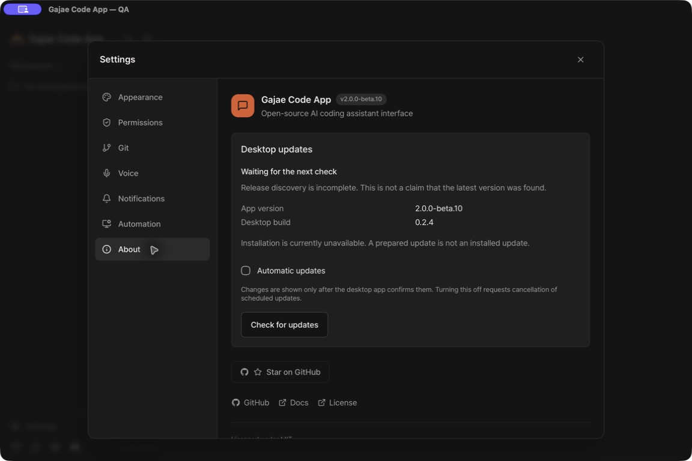

# Actual macOS updater preparation QA

This is **preparation/control-path evidence**, not completed automatic installation,
restart, public release or minimum-OS acceptance. The user could not remember the
button selected in the earlier authorization test and reported no known macOS 13
test machine/VM. Cancellation remains unconfirmed; no release gate was waived.

## Host and isolation

- Host: macOS 26.6.2 arm64; app built in debug mode with `GJC_UPDATE_MODE=qa`.
- Product/desktop versions remain beta.10 / 0.2.4. App signing is disposable
  ad-hoc signing, not Developer ID/notarization acceptance.
- `qa_profile_init` reuses `QaProfile::open` without constructing a window. It
  accepts only a fresh, canonical, current-owner/private `gajae-update-qa-*`
  directory directly under the system temporary directory. It does not fabricate
  a profile manifest or adopt an existing user/project directory.
- A private HTTPS feed and compiled QA CA were used; TLS validation stayed on.
  Only an existing QA public updater key was used. Test TLS private keys stayed
  outside the checkout and app; no production updater key was created.
- The app was copied outside the checkout into its compiled QA root. A complete
  20,636-entry inventory comparison and strict deep code-signature verification
  passed before the accepted run. An earlier merge-copy left stale resources;
  that copy was rejected and retained separately, then replaced with a clean copy.
- UI actions used the real `Gajae Code App — QA` window through Computer Use,
  not a mock React bridge. No normal app, credential store, conversation or
  worktree was used as the test target.

## Problems found and fixed

1. Remote Node 22/24 CI rejected the last snapshot-validator edit because
   `Object.hasOwn` is outside the frontend's ES2020 lib contract. The equivalent
   `Object.prototype.hasOwnProperty.call` check preserves the contract. Fix
   `6f99642`; CI run `34140074184` passed after failed run `34138220283`.
2. QA's long `TMPDIR` made the automation socket path 111 bytes. The OS bound a
   truncated path, so chmod on the intended name failed and the server exited.
   QA now explicitly uses its private root's short `a.sock`; roots too long for
   the target platform's `sockaddr_un.sun_path` are refused. A real bind test
   verifies that the expected pathname exists, not just its computed length.
3. The real About screen initially received 503 `updater_unavailable`. Accepted
   socket nonblocking mode caused the second read after HMAC authentication to
   fail before Node could send its command. A real NodeRelay-to-Rust protocol test
   reproduces the failure with an explicitly nonblocking accepted socket. Clearing
   that flag on the accepted stream fixes the test and actual app. Listener
   behavior, authentication, caps, peer-PID checks and total read deadline remain.
4. With automatic checks disabled, startup could keep the old `server_not_ready`
   reason indefinitely because no later network phase cleared it. Healthy
   initialization now starts with a fresh idle snapshot; it does not invent a
   completed discovery or installed update.

## Accepted interactive sequence

- App and supervised server started successfully; About displayed authoritative
  product/desktop versions, idle status and the explicit installation-unavailable
  boundary.
- Turning automatic checks off changed the native preference to
  `{"schema":1,"automatic":false}` only after the response.
- A manual check while automatic checks were off reached the HTTPS fixture
  (request count 6 to 8) without enabling automatic checking.
- A malformed release-list response produced the deferred discovery-failure UI
  (count 9). Restoring the valid empty list and checking again recovered to idle
  (count 11).
- After normal Quit, the tracked app, server and two core processes exited.
  Relaunch reused `http://127.0.0.1:57560`, kept automatic checking off, and made
  no additional feed request. About showed the persisted value and correctly
  kept discovery incomplete because no new scan had been performed.
- The final app signature remained valid after the run. The QA app and feed were
  normally stopped. Copies and private evidence were retained.



Evidence directory on the operator Mac:
`/private/tmp/gajae-updater-desktop.OnXczN/`. It contains build context/diff hashes,
copy verification, red/green protocol logs, feed request counts and GUI capture.
The app was a working-tree QA build based on `6f99642`, not a frozen release cut.

## QA-only installation journal proof

`examples/updater_journal_probe.rs` and `examples/support/updater_journal.rs` do not
start an app/server or invoke an installer. They exercise exclusive creation,
file/directory fsync before a live handle, blocking records after error/Drop/crash,
separate target-byte verification and exclusive archival in a cooperative private
fixture namespace. They reuse the product's actual presence-only admission guard.
Saved JSON never recreates ownership or clears a startup blocker.

Twenty tests passed; the one ignored subprocess helper is explicitly invoked by
the fault tests. The probe's success/cancel/failure values are **simulations**, not
macOS authorization or privileged-writer termination evidence. In particular, an
adversarial same-UID conditional-rename proof and real power-loss testing remain
outside this helper. Do not promote it into product installation authority.

Useful checks on a configured development checkout:

```sh
cargo test --locked --manifest-path src-tauri/Cargo.toml --example updater_journal_probe
cargo test --locked --manifest-path src-tauri/Cargo.toml --example qa_profile_init
cargo test --locked --manifest-path src-tauri/Cargo.toml real_node_relay_completes
```

The Node/Rust interoperability test requires the repository's supported Node and
installed `tsx` dependency. It launches a real child and verifies the same native
framing/handshake path; it is not a test of the installed application's lifecycle.

## Remaining boundary

The production installer, attempt resolver, full work/draft-safe manual restart,
embedded applying/recovery, signed product A→B/data acceptance, macOS 13 execution
and production signing-key custody are still pending. `restart` continues to
reject and `installationAvailable` remains false. Nothing here publishes or
installs a new production version.
