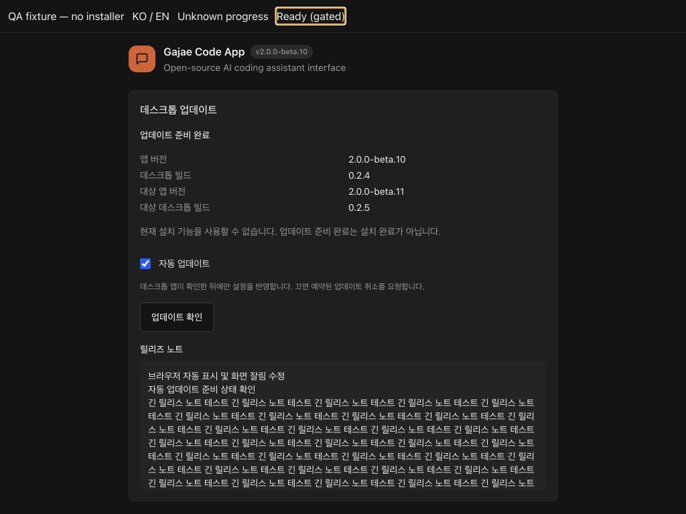

# macOS 자동 업데이트 — 남은 작업 인계

## 2026-09-08: 다음 시작 설치·후속 앱 건강 확인 연결

`DESKTOP-UPDATER-LAUNCH-QA.md`가 최신 네이티브 진행 기록이다. 격리된 debug QA에서
A(0.2.4) → B(0.2.5)의 실제 교체·자동 재실행·서버 건강 확인·schema-2 완료 기록과
프로젝트/초안/첨부/동일 origin 보존을 확인했다. **임시 서명 QA이며 공개 배포가
아니다.** 실행은 정확한 compile-bound QA profile과 명시적 qualification 인자로만
허용하며 production owner 증명/활성화, 전체 G3와 최종 G0/G5/배포는 남아 있다.

## 활성 목표: 자동 업데이트 완성과 앱 배포

목표는 준비 경로 구현으로 축소하지 않는다. 현재 이어지는 네이티브 설치 작업과
검증 근거, 다음 시작/건강 상태/복구 연결의 순서는
`DESKTOP-UPDATER-INSTALL-PROGRESS.md`에 있다. 공식 installer 호출, durable
attempt writer, 전체 설치 트리 검증 코드를 작성했지만 **앱 시작·재시작 경로는
아직 이 코드를 호출하지 않는다.** 원격 CI에서 드러난 엔진 테스트 SSOT 누락은
`7ef7cda`로 수정했다. 자동 설치/배포 완료를 선언하거나 목표를 닫지 않았다.

## 2026-09-08 재개: 실제 admission 연결과 초안 보존

`server/index.js`에 하나의 restart authority를 만들고 HTTP handler, 채팅 메시지,
PTY 메시지와 인증 전 경로에 연결했다. 응답/연결 종료와 실제 작업 종료를 구분하고,
준비 중 완료된 작업도 이전 prepare token을 무효화한다. chat/worker/shell의 실제
reader를 합치되 나머지 필수 owner는 누락 상태로 남겨 재시작을 차단한다.

OAuth 취소 후 정리, UI 완료 이후 제목 저장, 교체 중인 PTY를 실제 수명까지
추적한다. SDK 내부 백그라운드와 detached descendant 종료는 미확인이므로
유휴 상태라고 주장하지 않는다. 실제 composer에는 IndexedDB 기반의 초안·File·
대기 메시지 보존과 오래된 창의 덮어쓰기 방지를 연결했다.

구현/증거/남은 작업: `DESKTOP-UPDATE-ADMISSION-IMPLEMENTATION.md`.
**자동 설치·안전 재시작·공개 배포는 여전히 미완료다.** G0를 완화하거나 제품
installer를 켜지 않았으며 package/desktop 버전은 beta.10/0.2.4 그대로다.

## 사용자 환경 확인 후 실제 QA 앱 검증

사용자는 이전 인증창에서 무엇을 눌렀는지 기억하지 못하며 macOS 13 테스트
환경도 없는 것 같다고 답했다. 취소 성공과 OS13 검증은 **미확인 그대로**다.
추가 환경 준비를 사용자에게 요구하지 않고 현재 Mac의 격리 QA 증거를 보강했다.

- ES2020 `Object.hasOwn` 타입 오류를 수정해 원격 Node 22/24 CI를 통과시켰다
  (`6f99642`, run `34140074184`). 이전 로컬 검사 후의 마지막 편집이 CI에서 실패한
  것이며, 이전 head의 원격 CI까지 통과했다고 해석하지 않는다.
- 실제 debug/QA 앱의 기동을 막던 긴 automation socket 경로를 짧은 private
  `a.sock`으로 수정했다. 길이 한도는 플랫폼 구조체에서 얻고 실제 bind로 검증한다.
- 실제 About의 503 오류를 재현했다. accepted socket의 nonblocking 모드 때문에
  HMAC 응답 다음 read가 너무 일찍 실패했다. 인증/peer PID/시간·크기 한도는
  유지하면서 연결 읽기 모드를 수정했고 실제 Node↔Rust 회귀 테스트를 추가했다.
- 실제 QA 앱에서 native 상태, 설정의 durable 저장, 자동 확인 off 상태의 수동
  확인, 잘못된 피드 오류 및 복구, 정상 종료와 같은 origin 재실행/설정 보존을
  확인했다. auto-off 재기동의 잔존 `server_not_ready` 문구도 수정했다.
- 설치 시도 journal은 **examples 아래 QA-only 증명 도구**다. fsync 전 live
  handle 부재, 실패/Drop/crash 뒤 차단 기록 보존 등을 20개 테스트로 검사했다.
  실제 installer/writer 종료, 적대적 same-UID namespace, 전원 차단 또는 제품
  설치 resolver 검증이 아니다. 기존 생산 startup guard는 그대로 보수적으로 차단한다.

전체 근거와 재개 방법: `DESKTOP-UPDATER-QA-PREPARATION.md`.
생산 `/Applications` 앱, 실제 사용자 데이터, public release와 updater key는
변경하지 않았다. **자동 설치·재시작·공개 배포는 아직 완료되지 않았다.**

## 추가 구현: 메인 화면 준비 제어와 restart admission 기초

브랜치 `codex/macos-updater-completion`의 미배포 변경이다. **전체 자동
업데이트 완료가 아니며 설치·재시작은 계속 거부한다.** 아래 내용은 이어지는
이전 진행 기록의 ‘준비 경로 UI/bridge 없음’ 부분을 갱신한다.

- `shared/desktopUpdateProtocol.ts` + 공용 상태 fixture를 기준으로 native
  snapshot, 준비 상태/설정/수동 확인 명령과 About UI를 연결했다. 웹 알림은
  별도 SemVer/channel 기준이며 desktop에서는 native snapshot만 사용한다.
- native가 만든 일회성 stdin 초기화로만 Node relay에 연결 정보가 전달된다.
  비밀값은 환경변수/로그/브라우저 응답에 넣지 않는다. 혼합 stdout은 제어
  입력으로 사용하지 않고 소유자 전용 Unix socket을 사용한다.
- 연결마다 새로운 challenge/HMAC-SHA256 증명으로 native endpoint를 먼저
  인증한 뒤에만 view capability를 전송한다. macOS `LOCAL_PEERPID`가 실제
  소유 Node PID와 일치해야 하므로 socket을 바꿔 끼운 다른 프로세스가 진짜
  native에 challenge를 대신 전달할 수 없다. HMAC은 macOS 대상의 정확히
  고정한 `hmac=0.12.1`이며 기존 tempfile/getrandom 선택은 유지했다.
- HTTP는 desktop cookie + 정확한 Origin + 현재 main-view capability를 요구한다.
  페이지/서버 교체 시 권한을 폐기하고, preference 직렬화 잠금 안에서 다시
  권한과 mutation sequence를 확인한다. 오래된 요청이 새 opt-out을 덮지 않는다.
  4개 요청, 2초 relay deadline, 제한된 frame 크기이며 timeout은 취소/저장 성공이 아니다.
- QA 환경의 `env_clear()` 뒤에 relay flag를 설정한다. disabled/dev/Linux에서는
  제어 채널을 시작하지 않으며, native bridge 초기화 실패 시 자동 준비도 시작하지 않는다.
- About에 EN/KO 및 10-locale parity, null progress, 상태/오류/릴리즈 노트,
  실제 저장 응답 뒤에 반영하는 자동 설정과 수동 확인을 추가했다. 준비 완료를
  설치 완료로 표시하지 않는다. ordinary web에는 설치 제어가 없다.
- `DesktopRestartAuthority`는 하나의 가역 fence와 기존 owner snapshot을 합칠
  안전 기초다. 95개 테스트를 통과했지만 **실제 HTTP/WS/internal producer와
  아직 연결하지 않았으므로 G3 통과가 아니다.** 필요한 연결 지점은
  `DESKTOP-UPDATE-ADMISSION.md`에 있다. native `restart`도 명시적으로 거부한다.
- 검증: 통합 `npm run verify`, native locked tests 179 pass + 1 opt-in ignore,
  build-binding 10 pass, native clippy `-D warnings`, relay/HTTP/admission 141 tests,
  frontend DOM 33 tests를 부모가 실행해 통과했다. Browser 스킬의 격리 UI fixture로
  1024×768/390×844, 한국어/영어, 설정 반영과 미정 progress를 확인했다.
  이는 native packaged-app/설치 GUI 증거가 아니다.

격리된 About 상태 fixture의 화면(설치 실행 없음):



### 실제 installer probe 결과 정정

- 첫 authorization probe는 취소가 아니라 `install()` 성공으로 반환했다.
  별도 `authorization-approved-verification.json`에서 전체 B inventory,
  코드 서명·staple·Gatekeeper를 검증했다. 취소 성공으로 기록하지 않는다.
- 두 번째 probe(시작 `2026-09-07T14:52:06Z`, root suffix `F5tbr5`)는
  `install_failed`, exit 1/signal 없음으로 반환했다. 전체 A inventory 및
  서명·staple·Gatekeeper는 그대로였다. 사용자에게 실제 ‘취소’ 클릭 여부를
  확인 요청했으며 `humanActionConfirmed`는 아직 false다. 원인 구분 및 OS
  privileged writer 종료 증거를 단순한 PID 종료/오류 문자열로 대체하지 않는다.
- 로그/receipt/runner는 `/private/tmp/gajae-updater-resume.Ym5u1L/`에 유지했다.
  기존 승인 결과는 `authorization-approval-result.json`에 따로 보존했다.
  최신 `authorization-result.json`을 이전 승인 결과로 혼동하지 않는다.

### 그대로 남은 차단 조건

G0 취소·writer 종료/설치 오류 분류, 실제 macOS 13 검증, 전체 producer와
draft/첨부 보존의 G3 연결, install-attempt writer/resolver/다음 시작 적용,
safe restart와 embedded applying/recovery, 최종 서명된 제품 QA A→B 및 데이터
보존, production updater key custody/backup와 배포가 남아 있다. 이 Mac은
26.6.2이고 등록된 repository self-hosted runner는 0개이며 로컬 macOS 13 VM은
확인하지 못했다. 지원 하한이나 권한 검사를 낮추지 않았다. Package/desktop
버전은 beta.10/0.2.4 그대로이고 새 릴리즈·설치·production key 생성은 하지 않았다.

## 2026-09-07 추가 재개: 설치 기능 완성 요청

사용자가 재배포를 통한 업데이트 시험을 요청했고, 기존 beta.10의 updater가
disabled이고 웹 알림의 `/releases/latest`도 베타 전용 저장소에서 404인 사실을
설명한 뒤 **자동 업데이트 완성부터 진행**하도록 승인했다. 현재 브랜치는
`codex/macos-updater-completion`이며 아래 결과는 전체 기능 완료/배포가 아니다.

- 웹 알림 fallback을 releases 목록 + 표준 SemVer/channel 비교로 수정했다.
  14개 단위 테스트와 8개 DOM 테스트를 부모가 재실행해 통과했다. native 설치
  권한이나 UI는 추가하지 않았다. 전체 verify는 별도로 실행 중이다.
- `docs/DESKTOP-UPDATE-ADMISSION.md`에 실제 producer/owner와 zero-gap accounting
  미검증 지점을 정리했다. 이는 구현지도이며 G3 통과가 아니다.
- 현재 locked 공식 updater 2.6.0 probe를 다시 빌드했다. 새 private-CA HTTPS
  격리 fixture에서 역사적 signed beta.8→beta.9의 실제 `install()`이 반환했고,
  전체 B inventory, codesign, staple, Gatekeeper를 다시 확인했다. 기존 앱은
  실행하지 않았으며 `/Applications` 또는 실제 사용자 데이터는 수정하지 않았다.
  역사적 11.0 선언/13.0 loader 불일치는 그대로이므로 이 결과는 설치 primitive
  증거일 뿐 새 제품 릴리즈, macOS 13 또는 최종 signed QA A→B acceptance가 아니다.
- 취소 probe는 사용자 응답 대기 중이다. 임시 증거/runner:
  `/private/tmp/gajae-updater-resume.Ym5u1L/`. `authorization-running.json`이
  정확한 현재 root, driver, PID를 기록한다. 시작 시 PID는 11927이었다.
  스택 표본은 공식 `install_inner` → OSAKit `Script::execute`에서 대기함을 보였고,
  Computer Use의 테스트 앱 AX 읽기는 두 차례 timeout이었다. 창이나 실제 취소를
  관찰한 것으로 취급하지 않는다. 사용자에게 표시된 시스템 인증창을 취소하고
  알려 달라고 요청했다. 강제 종료/timeout 후 성공 처리하지 않는다.
- `replace-result.json`은 정상 교체 증거, `authorization-result.json`은 probe가
  반환한 뒤 생성된다. 재개 시 먼저 결과/프로세스를 확인하고 사용자의 실제
  동작과 전체 A 무결성·writer 종료를 별도로 입증한다. PID 숫자만 재사용하여
  신호를 보내거나, 결과 파일만으로 사용자 취소를 확인했다고 기록하지 않는다.
- 설치 수명주기/attempt writer·resolver, 좁은 native bridge, 전체 admission,
  About UI, OS13 실행, production key custody, 최종 QA/배포는 아직 남아 있다.
  G0/G3 조건을 완화하거나 production updater를 켜지 않았다.

## 2026-09-07 재개: 준비 경로 구현

사용자가 이 작업에서 구현 재개와 Astra xhigh 병렬 작업을 승인했다. 아래
14:36 중단 기록은 과거 상태이며, 이번 준비 경로의 결과로 대체되는 항목은
여기에 명시한다. 기존 GJC 원장/완료 영수증은 편집하지 않았다.

- `updater_manifest.rs`의 컴파일 오류·fixture 경로와 빌드 바인딩의 정상 GitHub
  slug 거부 오류를 수정했다. Cargo.lock을 기존 고정 버전으로 오프라인 동기화했다.
- `updater_archive.rs`: 추출하지 않는 gzip/tar/PAX 검사, 전체 파일/모드/해시/링크
  inventory, Info.plist·payload·런타임 closure·arm64 shell 검사.
- `updater_discovery.rs`: 3×30 페이지/30초 단위의 재개 가능한 탐색, 관찰한 최대
  desktop 버전, 불완전 탐색 표시, asset ID 재확인, 제한된 HTTPS redirect/다운로드,
  Retry-After. GitHub의 원자적 스냅샷이나 전역 최신 버전 증명은 아니다.
- `updater_store.rs` / `updater_signature.rs`: owner-only/descriptor 기반 캐시,
  exclusive stage와 fsync/atomic ready 게시, 취소된 stage 정리, crash orphan 용량
  상한, 실제 Minisign 검증. 재로드 시 같은 bytes의 서명·digest·전체 inventory를
  다시 확인한다. cache ready는 설치 허가나 설치 성공이 아니다.
- `updater.rs`: 단일 준비 owner/generation, opt-out 영속화와 취소, 수동 확인과
  설치 동의 분리, 6시간±10분 주기/1·5·30분 재시도, wake coalescing. 서버 health와
  navigate 성공 뒤에만 연결했고 서버 실패/종료 시 현재 준비 generation을 취소한다.
- `updater_binding.rs`: disabled/일반 dev/QA 바인딩 불일치는 업데이트 I/O 전 거부.
  QA root뿐 아니라 실제 실행 app와 데이터 root도 비교한다. QA HTTPS CA는 고정
  `${GJC_UPDATE_QA_ROOT}/updater-ca.pem`의 owner-only 공개 인증서를 **빌드 시** 읽어
  컴파일에 포함한다. 런타임 CA 입력이나 TLS 검증 비활성화는 없다.
- `expected_payload.rs`: 설치 payload의 package와 런타임 manifest를 빌드에 결합한
  독립 기대값과 비교한 뒤에만 서버를 시작한다. ready/health의 기존 독립 버전
  검증도 유지한다.

### 아직 연결하지 않은 기능

**전체 자동 업데이트 기능은 미완료다.** `installation_available`은 false이며
production updater 빌드를 활성화하거나 공개 릴리스하지 않았다. G001의 실제
OS 승인/취소·writer 종료·macOS 13 및 Linux 검증, 다음 시작 설치/attempt
writer/resolver/복구, G003의 main-view-bound bridge·전체 producer admission·안전
재시작, Settings/About UI, G004의 실제 서명된 A→B/GUI/사용자 데이터 보존 검증은
그대로 남아 있다. 일반 브라우저나 원격 SPA에 새 native capability를 주지 않았다.

준비 owner의 설정/수동 확인 메서드는 내부 계약 및 테스트만 있으며, 아직 사용자
설정 화면이나 API에 노출하지 않았다. bridge/UI 완료로 오인하지 않는다. 설치를
연결하기 전에 아래 G001/G003 차단 조건을 충족해야 한다.

### 이번 재개 검증

- 전체 `npm run verify` 통과(기존 채팅 UI 변경이 섞인 로컬 작업 트리 기준).
- 릴리스 도구: 234 tests, 224 pass, 10 Linux-only skip, 0 fail.
- desktop locked Rust tests: 164 pass + 1 opt-in archive fixture ignore,
  build-binding 9 pass, probe 19 pass. 별도 real archive fixture는 실제 실행해 통과했다.
  `cargo clippy --all-targets -- -D warnings`, `cargo fmt --check` 통과.
- 실제 private-CA HTTPS 테스트: 기본 trust client는 UnknownIssuer로 거부하고
  HTTP 요청 0, 컴파일용 CA를 추가한 client는 HTTP 요청 1로 성공했다. PEM/DER
  구문은 고정 WebPKI 파서로 검사한다. CA 자기서명/유효기간 인증 증명과는 구분한다.
- 독립 리뷰의 종료/ready 표시/owner retirement 경쟁 조건을 수정했다. 종료는
  cache fsync 잠금을 기다리지 않으며, snapshot은 epoch를 확인하고, retirement와
  겹친 healthy/수동 요청은 하나의 owner가 이어받는다. 관련 회귀 테스트 12개 통과.
- 기존 아카이브의 20,673개 inventory 항목을 JS 생산자와 읽기 전용으로 대조했다.
  이는 Apple 코드 서명·공증·모든 Mach-O의 OS floor·실제 설치/실행 증거가 아니다.
  대상은 기존 beta.9/desktop 0.2.3, SHA256
  `dda009d8e3d51a89fce3c61968fe386f1fcaad9954628aab4ea56ae6b8ffbe63`이다.
  그 fixture의 기대 floor는 역사적 Info.plist/shell 값 11.0이며 Bun의 13.0
  loader floor 불일치를 해결한 새 릴리스로 인정하지 않았다.
- 기존 채팅 UI/번역 변경은 수정하지 않았다. 실제 설치·인증창 실험·production
  signing/key provisioning·release publication은 실행하지 않았다.

QA root는 기존 `--qa-profile` 절차로 먼저 초기화하고 테스트 앱을 종료한 뒤,
그 root 안에 `updater-ca.pem`과 테스트 `.app`을 배치한다. 일반 QA의 nonempty
directory 보호를 우회하지 않는다. 인증서 fixture 테스트는 `openssl`을 사용하며
인증서/키는 소유한 임시 폴더 안에서만 생성·정리한다. OS trust store는 변경하지 않는다.

---

작성: 2026-09-07 14:36 KST. 사용자가 장시간 실행을 중단하고 **문서로 남은 작업만 인계**하도록 요청했다. 추가 구현·설치 실험·검증을 자동 재개하지 않는다. 완료 선언이 아니다.

## 재개 기준

- 기존 목표를 유지한다. G001 안전성 검증 미완료, G002 릴리스 도구 완료 기록 유지, G003 네이티브 수명주기/설정 미완료, G004 최종 실증 미완료.
- 원장: `.gjc/_session-01a076d3-db4a-760a-ae8e-1bad69cdb5b8/ultragoal/{goals.json,ledger.jsonl}`.
- 승인 기준: 같은 세션의 `plans/ralplan/01a076d3-db4a-760a-ae8e-1bad69cdb5b8/pending-approval.md` 및 참조된 `stage-03-revision.md`. 최종 SHA `60faa93543369cbfa326c8bfd8d6ff9f5b6e447c1fd60fb088e95a978221216a`. 미완결 stage04 리뷰를 승인 계획으로 바꾸지 않는다.
- 작업 트리에 채팅 UI·번역·릴리스·네이티브 변경이 섞여 있고 커밋되지 않았다. 일괄 되돌리기/스테이징/커밋 금지. 원본 `docs/plans/macos-auto-update.md`도 보존한다.
- 인계 시 `12-UpdaterArchive`, `15-ExpectedPayload`를 실제 paused 상태로 확인했다. 재승인 후 필요하면 같은 에이전트를 재개하고, 동일 작업을 새 에이전트에게 중복 배정하지 않는다.

## 1. 먼저 현재 미검증 변경을 확인

아래 코드는 작성됐지만 **이번 변경에 대한 부모 테스트·빌드·포맷·통합 검증은 아직 실행하지 않았다**. 과거 통과 결과를 적용하지 않는다.

| 파일 | 상태 / 남은 확인 |
|---|---|
| `src-tauri/src/updater_manifest.rs` | 엄격한 네이티브 매니페스트 파서 작성. 64KiB, 중복/미지 키, 날짜, 채널, 버전, 정규 URL 검증 테스트 미실행. |
| `shared/fixtures/desktop-update-manifest.json` | JS/Rust 공용 스키마 fixture. 서명은 구문 테스트용이며 실제 암호 검증 증거가 아니다. |
| `scripts/release/updater-artifacts.test.mjs` | 공용 fixture와 생산자 일치 테스트 추가, 미실행. |
| `src-tauri/src/main.rs` | macOS 파서 모듈 선언 추가. 준비 coordinator는 연결되지 않았다. |
| `src-tauri/{build.rs,Cargo.toml,update_build_binding.rs,tests/update_build_binding.rs}` | 빌드 바인딩 구현 및 후속 보완 중 정지. lock 갱신/컴파일/테스트 필요. |
| `src-tauri/src/updater_transport.rs`, `src-tauri/examples/updater_probe.rs` | 부모가 `fetch_response`, 제한된 Location/Retry-After, URL 토큰 오류 제거, `InvalidHeader` 및 테스트 추가. 새 API 사용처와 경고까지 확인 필요. |

인계 시 `src-tauri/src/{updater_archive,updater,updater_store}.rs`는 **존재하지 않음**을 확인했다. 특히 archive 담당자는 설계/조사 중 정지했으므로 구현 완료로 오인하지 않는다.

핵심 계약:

- `parse_manifest(bytes, &ProductIdentity { repository, artifact_prefix }) -> Result<Manifest, String>`.
- `Manifest`는 `semver::Version`, `Channel`, `minimum_system_version`, `archive_url`, `signature`, `commit`, `notes`, `pub_date`를 소유한다. 버전 비교는 `cmp_precedence` 사용.
- 현재 JS `strictVersion`은 build metadata를 거부한다. Rust도 이에 맞췄다. 이를 완전한 SemVer 입력 지원으로 과장하거나 생산자 의미를 무단 변경하지 않는다.
- 빌드 입력: `GJC_UPDATE_MODE`, `GJC_UPDATE_FEED_ORIGIN`, `GJC_UPDATE_PUBKEY`, `GJC_UPDATE_QA_ROOT`. 기본 disabled, production은 release/정규 origin/공개키 필수, QA는 컴파일에 바인딩된 소유자 전용 정규 임시 루트 필수. 실행 시 실제 `QaProfile` 일치 검증은 아직 연결되지 않았다.
- 후속 빌드 요청: `GJC_UPDATE_PRODUCT_NAME`, `GJC_UPDATE_PACKAGE_NAME` 출력 및 macOS 직접 의존성 tar `0.4.46`, flate2 `1.1.9`, plist `1.7.0`, sha2 `0.10.9`. 완료 여부를 파일에서 확인해야 한다. 새 버전 탐색 불필요.

## 2. G003: 설치와 분리된 준비 경로 구현

승인 계획은 설치 차단과 별개로 네이티브 다운로드/준비 작업을 허용한다. 다음 순서로 연결한다.

- [ ] 네이티브 읽기 전용 archive 검사: 유지보수되는 tar/gzip/plist 사용, 압축 250MiB/전체 확장 1GiB, 메타데이터/경로/멤버 한도, bounded PAX, 경로 탈출·중복·특수 파일·위험 링크 거부. 추출/설치는 하지 않는다.
- [ ] 전체 파일/모드/해시/링크 inventory와 서명된 Info.plist·payload package 정보를 매니페스트/제품 identity에 결합. arm64 확인. 코드 서명/설치 완료 증거와 구분한다.
- [ ] 정규 GitHub release discovery: 페이지/시간 제한, 관찰 후보 중 desktop 버전 최댓값, 불완전 조회를 ‘최신’으로 표시하지 않기, 채널 정책.
- [ ] native redirect 허용 정책, Retry-After, 제한된 archive 다운로드 → 실제 Minisign 검증 → 위 archive 검사.
- [ ] 소유자 전용 exclusive staging, fsync/원자적 게시, 전체 inventory와 digest/서명/릴리스·asset identity 보존. 재로드 시 다시 검증하고 파일 존재만 믿지 않기.
- [ ] 단일 실행 generation, 동의 영속화/취소, 건강한 서버 시작 후 실행, 주기·jitter·wake coalescing·재시도. disabled/일반 dev/바인딩 불일치 QA는 네트워크·쓰기 0.
- [ ] `supervisor.rs`의 실제 health 및 navigate 성공 뒤 `ready = true` 위치에 준비 경로만 연결. 설치·재시작·attempt 제거 권한은 추가하지 않는다.

## 3. G001 및 설치 통합의 차단 조건

- [ ] 선택된 updater **2.6.0**에서 실제 macOS 승인/취소 및 작업 종료·privileged writer 부재 증명. 2.11 분석을 선택 버전 증거로 사용하지 않는다.
- [ ] 취소 후 전체 A 무결성과 작업 종료가 모두 입증돼야 보류/시작 가능. 과거 auth runner의 `passed:true`는 사용자 취소나 writer 종료 증명이 아니다.
- [ ] durable attempt 게시/종료 판정, 모든 startup/Retry/quit/restart 경로의 소유권·gate. 현재 `updater_attempt.rs`는 존재 여부 차단 reader일 뿐 writer/resolver가 아니다.
- [ ] 불확실한 설치/승인 후 실패는 embedded recovery, 서버와 Retry 차단. timeout/heartbeat/health/version을 근거로 installer를 버리거나 재시도하지 않는다.
- [ ] 실제 macOS 13 실행 및 Linux locked build/패키지/런타임 inertness. macOS 26 측정과 정적 dependency 확인은 대체 증거가 아니다.

이 조건 전에는 product 설치 경로, attempt 자동 제거, 커스텀 installer/rollback을 연결하지 않는다.

## 4. 나머지 제품 기능 및 최종 검증

- [ ] 현재 main webview/navigation epoch에 결합된 인증된 native/backend bridge. 로그 프레임·복사 쿠키·브라우저·다른 창·이전 epoch는 권한 없음.
- [ ] HTTP/WS 및 모든 내부 producer의 zero-gap admission/accounting, 실제 업무 종료와 owned server exit 증명 후에만 수동 재시작. PTY/승인/위임/백그라운드/미확인 작업은 busy.
- [ ] Settings → About 및 embedded applying/recovery UI, 자동 업데이트 opt-out/진행/오류/메모, 실제 시스템 인증창 사전 안내. 채팅 입력창 컨트롤 추가 금지.
- [ ] 교정된 updater-enabled QA A→B에서 설치 전 서버 차단, 성공 후 독립 버전/health, 사용자 데이터·origin·draft·프로젝트/worktree 보존을 실제 확인.
- [ ] 전체 변경 합집합 검증, cleaner/architect/red-team/terminal critic, 기존 runbook 갱신. production key custody·Apple 서명·공개 릴리스는 별도 승인 사항.

## 재사용할 증거 / 재개 검증

기존 네트워크·서명·lock·릴리스 증거를 다시 만들지 말고 재사용한다. `dist-native/updater-evidence/p0-network-L07XVN/`에 크기/지연/TLS 거부 원시 기록과 해시가 있다. `untrusted-tls-manifest.json`은 unknown-CA, HTTP 요청/본문 0, 전체 A 불변 증거다. 모두 **G0 전체 완료나 실제 OS13/설치 종료 증거는 아니다**.

재개 시 현재 파일과 Cargo.lock을 먼저 맞춘 뒤 변경 합집합에 대해 실행할 출발점:

```sh
. "$HOME/.nvm/nvm.sh" && nvm use 22
node --test scripts/release/updater-artifacts.test.mjs
. "$HOME/.cargo/env"
env -u TAURI_CONFIG CARGO_NET_OFFLINE=true cargo +1.85.1 test --locked --manifest-path src-tauri/Cargo.toml
env -u TAURI_CONFIG CARGO_NET_OFFLINE=true cargo +1.85.1 test --locked --manifest-path src-tauri/Cargo.toml --example updater_probe
```

위 명령은 인계 중 실행하지 않았다. compile/unused 경고, 테스트 실패, 신규 계약 불일치를 먼저 해결하고 전체 gate와 실제 플랫폼 검증으로 확장한다. `/tmp` fixture feed는 종료됐을 수 있으며 TLS 인증서 만료를 확인한 후 사용한다. 설치·인증 실험을 자동 반복하지 않는다.
